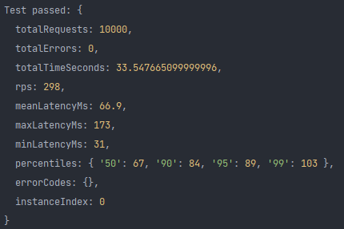

# Práctica única
## Marvin Eduardo Catalán Véliz
## 201905554

### ¿Por qué usar microservicios en los programas?

Los microservicios son una arquitectura de software que se enfoca en dividir una aplicación en servicios independientes, cada uno con su propio conjunto de funcionalidades y responsabilidades. Esto permite que los servicios puedan ser desarrollados, implementados y escalados de manera independiente, lo que resulta en una aplicación más flexible, escalable y fácil de mantener.

Los microservicios también permiten una mayor modularidad en el desarrollo de aplicaciones, lo que significa que los desarrolladores pueden trabajar en equipos más pequeños y especializados, lo que aumenta la velocidad y calidad del desarrollo de software.

Además, los microservicios permiten una mayor resiliencia y disponibilidad de la aplicación, ya que si uno de los servicios falla, los otros servicios pueden continuar operando sin interrupciones, lo que mejora la experiencia del usuario y reduce el tiempo de inactividad de la aplicación.

En resumen, el uso de microservicios en los programas puede ayudar a mejorar la escalabilidad, flexibilidad, modularidad, resiliencia y disponibilidad de la aplicación.

## Pruebas de estrés

### Escenario 1
#### Configuración
```
{
    url:'http://localhost:8080/movie/',
    maxRequests: 500,
    concurrency: 10,
    timeout: 5000
}
```
#### Resultado


#### Análisis

En el Escenario 1, se realizaron 500 solicitudes en 1.5 segundos sin errores. El promedio de tiempo de respuesta fue bajo, alrededor de 29 milisegundos, y el tiempo de respuesta máximo fue de 58 milisegundos. Estos son resultados muy buenos y sugieren que la aplicación tiene un buen rendimiento y es capaz de manejar cargas de trabajo moderadas sin problemas.

### Escenario 2
#### Configuración
```
{
    url: 'http://localhost:8080/nombre',
    maxRequests: 1000,
    concurrency: 10,
    timeout: 5000
}
```
#### Resultado


#### Análisis

En el Escenario 2, se realizaron 1000 solicitudes en 3.18 segundos sin errores. El promedio de tiempo de respuesta aumentó ligeramente a 31.5 milisegundos, y el tiempo de respuesta máximo fue de 175 milisegundos. Si bien estos resultados son todavía buenos, el aumento en el tiempo de respuesta sugiere que la aplicación puede estar comenzando a sentir la carga adicional.

### Escenario 3
#### Configuración
```
{
    url: 'http://localhost:8080/carnet',
    maxRequests: 10000,
    concurrency: 20,
    timeout: 5000
}
```
#### Resultado


#### Análisis

En el Escenario 3, se realizaron 10,000 solicitudes en 33.55 segundos sin errores. El promedio de tiempo de respuesta se incrementó significativamente a 66.9 milisegundos y el tiempo de respuesta máximo fue de 173 milisegundos. Estos resultados indican que la aplicación puede estar comenzando a tener dificultades para manejar cargas de trabajo más pesadas.

### Conclusión general sobre las pruebas de estrés
los resultados sugieren que la aplicación tiene un buen rendimiento en cargas de trabajo moderadas, pero puede estar experimentando dificultades para manejar cargas más pesadas. Sería necesario realizar pruebas adicionales para comprender mejor el comportamiento de la aplicación bajo diferentes cargas y para identificar posibles cuellos de botella o problemas de rendimiento.
